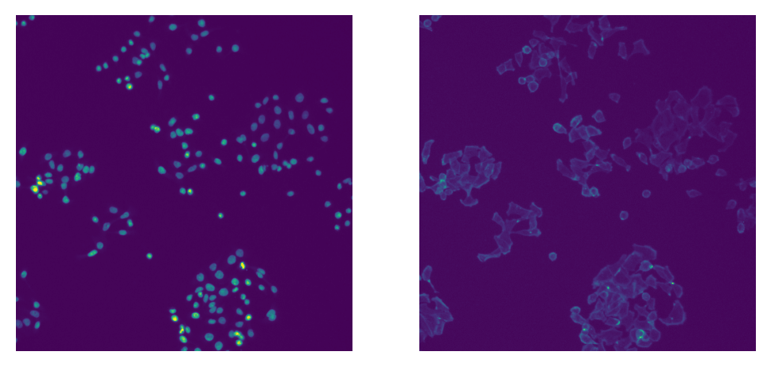
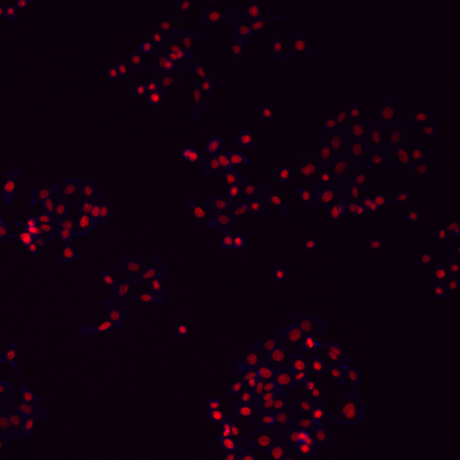
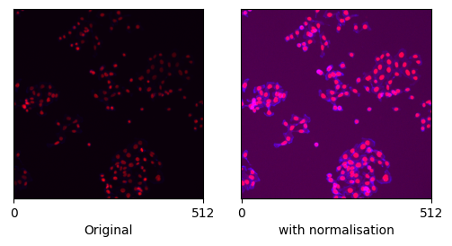
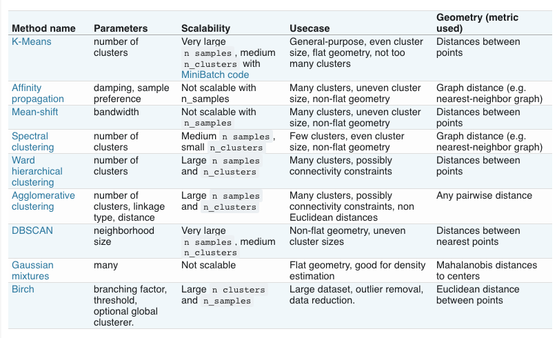
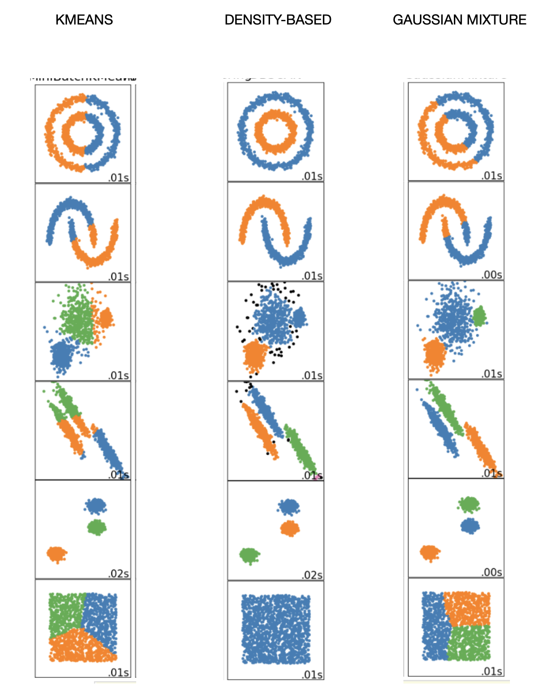
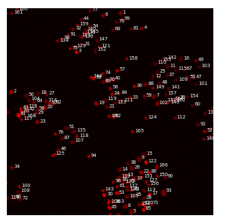

[**Download Chapter notebook (ipynb)**](01-section1.ipynb)

[**Download Chapter pdf**](01-section1.md.pdf)

:::::::::::::::::::::::::::::::::::::: questions 

- How to work with image data?
- What are different ways to explore and visualise image data?
- How is image clustering performed?
- How can we perform nuclei segmentation?

::::::::::::::::::::::::::::::::::::::::::::::::

::::::::::::::::::::::::::::::::::::: objectives

- Basic image handling: reading in image files, and how to convert them into numerical arrays.
- Measurement of pixel intensity, plotting these data as histograms, and learning how to equalise these intensity values across an image.
- OpenCV to normalise pixel intensities of an image.
- Constructing and interpreting scatter plots of pixel intensities.
- Selecting and zooming in on specific parts of an image, for analyses.
- Clustering of images to identify and isolate objects.
- Counting nuclei *via* image segmentation, targeting cell nuclei using StarDist.

::::::::::::::::::::::::::::::::::::::::::::::::


::::::::::::::::::::::::::: discussion
## **Why is Image Analysis important?**
Image Analysis extracts meaningful data and can be useful in many different applications. Such as:

1. Analysing fluorescent digital slides, which can help to quantify the area of staining of a particular biomarker.

2. Image analysis tools can help to automate repetitive processes, and provide quantitative data that is accurate and reproducible: beyond the capabilities of manual microscopy.

3. Image analyses performed on fluorescent micrographs can help answer questions such as: 

  - How much area of a tissue sample is stained for a particular biomarker? 

  - What is the average intensity of a biomarker staining throughout the sample? 
  
  - Do multiple biomarkers co-localize in the tissue, or within individual cells? If so, to what extent?
  
:::::::::::::::::::::::::::
  
### **What is an image?**
  
Images are essentially a matrix in which each index is assigned a number, representing the value at that specific point. 
<p style='text-align: justify;'>
These indices, more commonly called pixels, are a measure of how many photons hit that particular position on the camera sensor. As these images are matrices, we can do many of the same mathematical operations on images as we do on matrices. However, we don't want to manually generate every image by populating a matrix. This means that we will have to have some manner of interacting with image files on our computer, programmatically. 
</p>
<p style='text-align: justify;'>
For all scientific images, you should save them in a file format that minimizes the data lost due to compression. In the field of image analysis, the most common file format you will run into is the Tagged Image File Format (.tiff or .tif) which is a lossless compression format. 
</p>
<p style='text-align: justify;'>
In this tutorial, we will learn how to load, manipulate and extract quantitative data from microscopy images. The data set used in this experiment has been taken from [Broad Bioimage Benchmark Collection](https://bbbc.broadinstitute.org/BBBC008) and presents *Human HT29 colon-cancer cells*.
</p>

### **Images in dataset**
<p style='text-align: justify;'>
The image set consists of 12 individual images. The samples were stained with Hoechst (channel 1), pH3 (channel 2), and phalloidin (channel 3). Hoechst labels DNA, which is present in the nucleus. Phalloidin labels actin, which is present in the cytoplasm. The last stain - pH3 - is used to indicate cells in mitosis, and is irrelevant for segmentation and counting, so this channel will be omitted. In this tutorial we will be exploring channel 1 for nuclei, and channel 3 for the cytoplasm.
</p>

### **Packages**
<p style='text-align: justify;'>
There are several image processing libraries available in Python, such as *Python Imaging Library*, *Sci-kit Image*, *Scipy.ndimage* and *Open CV*. While each have their own features, they all have the same (or at least very similar) utilities. In this lesson, we will be using the *Python Imaging Library* and *Sci-kit Image*, as these have everything we require, packaged together in easy-to-use functions.
</p>
<p style='text-align: justify;'>
The *Python Imaging Library (PIL)* has a large number of modules and submodules. Each submodule has an array of functions associated with a certain type of operation. For example, we will be using module **Image** which provides a number of factory functions, including functions to load images from files, and to create new images.
</p>
For other basic processing and plotting in Python, the scientific packages Numpy and Matplotlib are needed.


In a blank Jupyter Notebook, open a new cell, and write your own Python code to import the following packages and modules:

- Import pyplot as plt from matplotlib
- Import numpy
- Import glob
- From PIL, we need the Image module
- From skimage, we need the exposure module


```python
# Loading the packages

from PIL import Image # Python Image Library (Pillow)
from skimage import exposure

import matplotlib.pyplot as plt
import numpy as np

import glob
```

## Loading images
To begin, let's read in all the images from a directory, and then load an image into memory using the **open** function from the **Image** module of *Python Imaging Library*. This function opens and identifies the given image file.


```python
## Get image files

ch1_files = glob.glob('data/human_ht29_colon_cancer_2_images/*_channel1.tif') # channel 1 image - nuclei
ch3_files = glob.glob('data/human_ht29_colon_cancer_2_images/*_channel3.tif') # channel 3 image - cytoplasm

## Check they are correctly paired
print(ch1_files[0], ":", ch3_files[0], "\n")

## Sort files

ch1_files.sort()
ch3_files.sort()

## Check they are correctly paired
print("Correctly paired .... \n")
print(ch1_files[0], ":", ch3_files[0], "\n") # First file
print(ch1_files[11], ":", ch3_files[11], "\n") # Last file

## Load the first image

im1 = Image.open(ch1_files[0])
im3 = Image.open(ch3_files[0])
```

```{.output}
data/human_ht29_colon_cancer_2_images/AS_09125_050116000001_A24f00d0_slice2_channel1.tif : data/human_ht29_colon_cancer_2_images/AS_09125_050116000001_A24f00d0_slice4_channel3.tif 

Correctly paired .... 

data/human_ht29_colon_cancer_2_images/AS_09125_050116000001_A24f00d0_slice1_channel1.tif : data/human_ht29_colon_cancer_2_images/AS_09125_050116000001_A24f00d0_slice1_channel3.tif 

data/human_ht29_colon_cancer_2_images/AS_09125_050116000001_L15f00d0_slice6_channel1.tif : data/human_ht29_colon_cancer_2_images/AS_09125_050116000001_L15f00d0_slice6_channel3.tif 
```


```python
## Show Data

fig, axs = plt.subplots(1,2, dpi = 300, figsize=(6, 6))

axs[0].imshow(im1);
axs[0].axis('off')

axs[1].imshow(im3);
axs[1].axis('off');
```

```{.output}
(-0.5, 511.5, 511.5, -0.5)
```




```python
type(im1)
```

```{.output}
<class 'PIL.TiffImagePlugin.TiffImageFile'>
```

<p style='text-align: justify;'>
The above command shows the type of image object im1. In order to perform any analyses, we need to have the numerical information of an image, which exists as arrays. The arrays are implemented by a package called Numpy, which is foundational to the entire scientific Python ecosystem. As soon as we perform numerical computations, we use data in the form of Numpy arrays.
</p>

Below, we convert the image object into an array, as follows:
  

```python
## Convert image to array

data1 = np.asarray(im1)
data3 = np.asarray(im3)

print('Image has', data1.shape[0], 'by', data1.shape[1], 'pixels') # check the shape of array
print('')
print('Total number of pixels is', data1.size) # check the size of array
```

```{.output}
Image has 512 by 512 pixels

Total number of pixels is 262144
```


```python
# Check the content of the array

print(data1)
print('')
print(data1[10:20, 10:20])
print('')
print('Array type:', type(data1))
print('Data type: ',  data1.dtype)
```

```{.output}
[[11 11 11 ...  9 10 10]
 [12 11 11 ... 10  9 11]
 [11 11 11 ... 10 11 10]
 ...
 [11 11 11 ... 10 10 10]
 [12 11 11 ...  9 10 10]
 [11 11 11 ... 10 10 10]]

[[128 150 137 100  53  27  18  14  12  10]
 [155 177 172 136  73  38  21  15  11  11]
 [140 146 154 144  96  50  24  15  13  11]
 [133 144 139 122  95  55  26  15  13  11]
 [114 117 122 103  78  46  22  14  11  10]
 [ 79  87  97  78  54  32  18  12  11  12]
 [ 48  54  53  46  27  20  14  12  10  11]
 [ 20  22  23  20  15  13  13  11  11  11]
 [ 17  16  15  14  13  11  11  11  10  12]
 [ 12  14  14  13  14  12  12  12  11  11]]

Array type: <class 'numpy.ndarray'>
Data type:  uint8
```

<p style='text-align: justify;'>
The type function has returned numpy.ndarray where nd stands for n-dimensional, as Numpy can handle data of any dimension. The above output only shows us a fraction of the image, with the ```...``` indicating non-displayed values. We can also observe `dtype`, which tells us the type of the pixels within the array. The variable data1 is an array, but its content can vary: we could have floating point values, integers *etc*. Here, uint8 tells us we have unsigned (no negative values) integers in 8 bit, *i.e.* up to $2^8$ different possible pixel values.
</p>
<p style='text-align: justify;'>
In microscopy, the fluorescent images are labelled with three colours: red, green and blue (RGB). An RGB image is simply a stack of three two-dimensional arrays. The image in the first dimension will have a red colour map, the second a green colour map, and the third a blue colour map. In this dataset, channel 1 (nuclei) is labelled red, and channel 3 (cytoplasm) is labelled blue; channel 2 is empty. We will now combine the data of these two images into a single array, and into a single image.
</p>


```python
# Combine data of two images
data = np.zeros((data1.shape[0], data1.shape[0], 3)) # 3 two-dimensional arrays; 1 for each channel
data[:,:,0] = data1 # Assigning image 1 as first channel
data[:,:,2] = data3 # Assigning image 3 as 3rd/last channel

# Converting numeric data to image
im = Image.fromarray(np.uint8(data)) 
```


```python
# Show combined data
fig, axs = plt.subplots(1, 3, dpi = 400)

axs[0].imshow(data1);
axs[0].axis('off');

axs[1].imshow(data3);
axs[1].axis('off');

axs[2].imshow(im); # Combined image
axs[2].axis('off')
```

```{.output}
(-0.5, 511.5, 511.5, -0.5)
```


and enlarged:
  
```
im
```

The combined image shows red (nuclei) and blue (cytoplasm) colors.

## Data Exploration
<p style='text-align: justify;'>
In image analysis, one of the most common tasks is to look at the distribution of pixel intensities, and display this as a histogram. For example: we can count how many times each pixel value (or range) appears in an image, and display this as a bar. This allows us to get a quick estimate of the intensities present in an image and to check for problems like saturation. We are going to plot the intensities of channel 1 and 3 as histograms.  
</p>

<p style='text-align: justify;'>
We have already demonstrated that we can use Matplotlib’s `imshow` function to display an image. Now we look at a second plotting function from that library, which generates a histogram plt.hist(). We are aiming to compute the histogram on all pixels, and for this we cannot use our 2D image as an input. The image needs to first be flattened into a single series of numbers. This can be done with the ravel() method of the array:
</p>


```python
# Plot histogram
fig, axs = plt.subplots(2, sharex=True, sharey=True)

axs[0].hist(data1.ravel(), bins=100);
axs[0].set_title("nuclei");
axs[0].set_xlim(0,40)

axs[1].hist(data3.ravel(), bins=100);
axs[1].set_title("cytoplasm");
axs[1].set_xlim(0,40)

plt.show()

print(data1.max(), ":", data3.max())
```

```{.output}
(0.0, 40.0)
(0.0, 40.0)
```


```{.output}
255 : 122
```

<p style='text-align: justify;'>
The histograms show that there is a very high intensity of fluorescence for nuclei, relative to the cytoplasm, and this is the reason that red is more evident on the image, compared to blue. The intensities can be equalised by using a function *exposure.equalize_hist* from the **exposure** module in skimage library. This function returns an image which can then be used to plot a histogram.
</p>


```python
# Equalize histogram 
from skimage import exposure

img_eq = exposure.equalize_hist(data)

plt.figure(dpi=100)
plt.imshow(img_eq)
plt.axis('off')
plt.show()
```

```{.output}
/home/runner/.virtualenvs/carp-env/lib/python3.10/site-packages/skimage/_shared/utils.py:326: UserWarning: This might be a color image. The histogram will be computed on the flattened image. You can instead apply this function to each color channel, or set channel_axis.
  return func(*args, **kwargs)
(-0.5, 511.5, 511.5, -0.5)
```


::::::::::::::::::::::::::::::: challenge 

## Do it Yourself - Exercise 1

Plot a histogram for equalised image, and show intensities of nuclei and cytoplasm.
	
::::::::::::::::: solution
	
## DIY ANSWER


:::::::::::::::::

::::::::::::::::::::::::::::::: 


### **OpenCV**
<p style='text-align: justify;'>
To demonstrate the vast functionality available in Python, we will take a look at __OpenCV__. OpenCV (Open Source Computer Vision Library: http://opencv.org); an open-source library that includes several hundred computer vision algorithms.
</p>
<p style='text-align: justify;'>
As an example, we can use functions to flexibly rescale our image data. This helps to enhance visibility of features that are limited to a narrow range of intensities. Mathematical normalisation can be performed on whole images, or with respect to a single channel. In the following example, we normalise the whole image with respect to channel 1. To do so, we calculate the mean and standard deviation of the pixel intensities of channel 1, clip the image to plus / minus the values obtained (which preserves most of the intensities) and then rescale the result to values between 0 and 255 for full image resolution.
</p>


```python
# Normalise to a different channel

import cv2

# Calculate mean and STD of nuclei image, channel 1
mean, STD = cv2.meanStdDev(data1)

# Clip frame to lower and upper STD
data_clipped = np.clip(data, mean - STD, mean + STD).astype(np.uint8)

# Normalise to range
data_clipped_normalised = cv2.normalize(data_clipped, None, alpha=0, beta=255, norm_type=cv2.NORM_MINMAX)

# Rename the results of normalisation
result = data_clipped_normalised
```


```python
fig, ax = plt.subplots(ncols=2)

ax[0].boxplot(data[:,:,0].ravel());
ax[0].set_xlabel('Original Intensities')
ax[1].boxplot(data_clipped[:,:,0].ravel());
ax[1].set_xlabel('Clipped Intensities');

plt.show()
#fig.savefig('clipped.png')
```


```python
# Plot normalised image
fig, ax = plt.subplots(ncols=2, figsize=(6,6), dpi=200)

ax[0].imshow(im);
ax[0].set_xticks((0, data.shape[0]));
ax[0].set_yticks([]);
ax[0].set_xlabel('Original')

ax[1].imshow(result);
ax[1].set_xticks((0, data.shape[0]));
ax[1].set_yticks([]);
ax[1].set_xlabel('with normalisation');
```



::::::::::::::::::::::::::::::: challenge 

## Do it Yourself - Exercise 2

Normalise the combined image with respect to cytoplasm.
	
::::::::::::::::: solution
	
## DIY ANSWER


:::::::::::::::::

::::::::::::::::::::::::::::::: 

## Tea Break

## Data Visualisation

Now we can plot histograms of the normalised intensities in channel 1, channel 3, and the background.


```python
# Plot histograms
fig, axs = plt.subplots(3, sharex=True, sharey=True)

axs[0].hist(result[:,:,0].ravel(), bins=30);
axs[0].set_title('Nuclei')

axs[1].hist(result[:,:,2].ravel(), bins=30);
axs[1].set_title('Cytoplasm')

axs[2].hist(result[:,:,2].ravel() - result[:,:,0].ravel(), bins=30);
axs[2].set_title('Cytoplasm - Nuclei')

fig.tight_layout();

plt.show()
```


The third histogram shows everything (background signal), except for nuclei and cytoplasm.

To investigate correlations between the intensities, we can look at a scatter plot (below left, once you run the cell, below). This type of plot is generally useful for exploratory data analysis. 

<p style='text-align: justify;'>
We can see that the scatter plot is quite dense, and it is not really possible to see how many points are present, at a given location. We can display this information with the two-dimensional histogram (below centre). This clearly shows the count of points that fall into a certain square of intensities. (Note the thin, yellow area towards the right margin).
</p>

### **Seaborn**
<p style='text-align: justify;'>
From a python plotting library called [seaborn](https://seaborn.pydata.org), we can import a function called `kdeplot`, which allows us to make a contour plot of the intensities. The contour plot confirms that there are at least two distinct distributions. Such a finding might inspire grouping the intensities into different categories, or clusters.
</p>

::::::::::::::::::::::: callout
## Note
This plot might take a bit longer to run, as there are a large number of data points. 
::::::::::::::::::::::: 


```python

fig, ax = plt.subplots(1, 3, figsize=(20, 6))

# Scatter plot
ax[0].scatter(result[:,:,0].flatten(), result[:,:,2].flatten());

# # 2D Histogram
ax[1].hist2d(result[:,:,0].flatten(), result[:,:,2].flatten(), bins=50, vmax=50);

from seaborn import kdeplot

# Density Plot
kdeplot(x=result[:,:,0].flatten(), y=result[:,:,2].flatten(), ax=ax[2]);

plt.show()
```


## Selecting part of an image

It is also possible to analyse a small region of an image. The image can be cropped, and then analyses can be performed on the selected region.


```python
# Annotating the regions
from matplotlib.patches import Rectangle

x, y, w, h = 450, 10, 60, 50

fig, ax = plt.subplots(dpi = 100)

plt.imshow(result)

ax.add_patch(Rectangle((x,y), w, h, edgecolor="w", fill=False));

plt.show()
```


```python
# plot what's in box
fig, ax = plt.subplots(dpi=100)
plt.imshow(result[y:y+h, x:x+w,]);
plt.axis('off')
plt.show()
```

```{.output}
(-0.5, 59.5, 49.5, -0.5)
```


```python
result[y:y+h, x:x+w, 0].shape
result[:,:,0].shape
```

```{.output}
(50, 60)
(512, 512)
```

The region in the rectangle does not have any cells. Plotting a histogram for this region versus full image will result in the following plot.


```python
# Plot histogram 
fig, axs = plt.subplots(2, sharex=True)

axs[0].hist(result[:,:,0].ravel(), bins=30, label='intensity in all image');
axs0_2 = axs[0].twinx()
axs0_2.hist(result[y:y+h,x:x+w,0].ravel(), bins=3, color='r', alpha=0.3);
axs[0].set_title('Nuclei')
axs[0].legend()

axs[1].hist(result[:,:,2].ravel(), bins=30);
axs1_2 = axs[1].twinx()
axs1_2.hist(result[y:y+h,x:x+w,2].ravel(), bins=3, color='r', alpha=0.3, label='intensity in ROI');
axs[1].set_title('Cytoplasm')

plt.legend()
plt.show()
```


<p style='text-align: justify;'>
This plot compares the intensity of the pixels in the total image (blue) to those in the region of interest (ROI) bounded by the rectangle. If we move the ROI over cells, we can see how this intensity changes.
</p>

::::::::::::::::::::::::::::::: challenge 

## Do it Yourself - Exercise 3

Move the rectangle towards left so that it contains a few cells. Now plot the histogram again and see the differences.
	
::::::::::::::::: solution
	
## DIY ANSWER


:::::::::::::::::

::::::::::::::::::::::::::::::: 


::::::::::::::::::::::::::::::: challenge 

## Do it Yourself - Exercise 4

Repeat this process for other images (in the folder) and save 3-4 examples of cells with nuclei and cytoplasm marked

	
::::::::::::::::: solution
	
## DIY ANSWER


:::::::::::::::::

::::::::::::::::::::::::::::::: 

## Lunch Break

## Image clustering

[Clustering Methods](https://scikit-learn.org/stable/modules/clustering.html)






```python
# Preparing the data for clustering

img1 = result[:,:,0].reshape(-1, 1)
img2 = result[:,:,2].reshape(-1, 1)

all_imgs = np.concatenate([img1, img2], axis=1)

all_imgs.shape
```

```{.output}
(262144, 2)
```


```python
# Import the clustering class
from sklearn.mixture import GaussianMixture

# Cluster the images and obtain the labels for each pixel
n_components = 3

RANDOM_STATE = 12345

gmm = GaussianMixture(n_components=n_components, 
                      random_state=RANDOM_STATE)

all_img_labels = gmm.fit_predict(all_imgs)

all_img_labels[0]
```

```{.output}
0
```


```python
fig, ax = plt.subplots(figsize=(6, 6))

ax.scatter(img1[img1 > 0], img2[img2 > 0], c=all_img_labels, s=50)

ax.set_xlabel('Image 1', fontsize=16)
ax.set_ylabel('Image 2', fontsize=16);

plt.show()
```


```python
from numpy import zeros

mask = (data1>0) & (data3>0) 

all_img_labels_mapped = zeros(data1.shape)

all_img_labels_mapped[mask] = all_img_labels
```


```python
fig, ax = plt.subplots(figsize=(6, 6))

ax.imshow(all_img_labels_mapped);

plt.show()
```


The result depends critically on the specified number of clusters.

::::::::::::::::::::::::::::::: challenge 

## Do it Yourself - Exercise 5

Change n_components to 2, 4, 5 and 6 and compare the results.
	
::::::::::::::::: solution
	
## DIY ANSWER


:::::::::::::::::

::::::::::::::::::::::::::::::: 

::::::::::::::::::::::::::::::: challenge 

## Do it Yourself - Exercise 6

Apply the Kmeans algorithm to the images and compare the result of the clustering for different choices of n_components.

[Documentation](https://scikit-learn.org/stable/modules/generated/sklearn.cluster.KMeans.html)# To import:

```
from sklearn.cluster import KMeans
```

::::::::::::::::: solution
	
## DIY ANSWER


:::::::::::::::::

::::::::::::::::::::::::::::::: 

## Tea Break
## 
## Segmentation
Image segmentation allows us to locate objects and boundaries (lines, curves, *etc.*) within an image. Conventional methods make use of a threshold value to distinguish between different regions and/or cells. In this lesson, we will use a Python package called [**StarDist**](https://github.com/stardist/stardist), which makes use of deep learning methods to perform nuclei segmentation. It is designed particularly for nuclei segmentation. **StarDist** comes with pretrained models, that are likely suitable for your micrograph images. However, it is also possible to train your model specifically for your dataset.


```python
## Load as images - Using Raw images

data1 = Image.open(ch1_files[0])

nuclei = np.zeros(np.shape(im))
nuclei[:, :, 0] = data1

plt.figure(dpi=100)
plt.imshow(nuclei.astype(int))
plt.axis('off')

plt.show()
```

```{.output}
(-0.5, 511.5, 511.5, -0.5)
```


```
from stardist.models import StarDist2D
from stardist import random_label_cmap

from csbdeep.utils import Path, normalize

axis_norm = (0,1)   # normalize channels independently
img = normalize(nuclei[:,:,0], 1,99.8, axis=axis_norm)

model = StarDist2D.from_pretrained('2D_versatile_fluo')
lbl_cmap = random_label_cmap()
```

<p style='text-align: justify;'>
By running this Python code, you will see this message. This suggests that everything is working fine. The package **StarDist** requires the installation of a deep learning package **tensorflow**.
</p>

**Output**
```
Found model '2D_versatile_fluo' for 'StarDist2D'.
Loading network weights from 'weights_best.h5'.
Loading thresholds from 'thresholds.json'.
Using default values: prob_thresh=0.479071, nms_thresh=0.3.
```

<p style='text-align: justify;'>
In order to access pretrained models, the function *StarDist2D.from_pretrained()* provides a list from which a suitable model can be selected. There are two main types of models: one for fluorescent images, and the other for brightfield images. For our image, **StarDist** will perform nuclei prediction using *2D_versatile_fluo*.
</p>

The availability of pretrained models can be checked as follows:

```
StarDist2D.from_pretrained()
```

**Output**
```
There are 4 registered models for 'StarDist2D':

Name                  Alias(es)
             
'2D_versatile_fluo'   'Versatile (fluorescent nuclei)'
'2D_versatile_he'     'Versatile (H&E nuclei)'
'2D_paper_dsb2018'    'DSB 2018 (from StarDist 2D paper)'
'2D_demo'             None
```

```
# Using pre-trained network to predict nuclei
labels, details = model.predict_instances(img)
```

```
## Show data

fig, axs  = plt.subplots(1,2, dpi=200)
axs[0].imshow(nuclei.astype(int))
axs[0].axis('off')

axs[1].imshow(nuclei.astype(int))
axs[1].imshow(labels, cmap=lbl_cmap,alpha=0.5)
axs[1].axis('off')

```


<p style='text-align: justify;'>
The image on the right is a segmented image, with correctly identified and predicted nuclei. This image is also referred to as a masked image. The next step will allow us to count the number of nuclei in this image, which is performed as follows:
</p>

```
# Enumerate nuclei
plt.figure(dpi=100)
plt.imshow(nuclei.astype(int))

for i, xy in enumerate(details['points']):
    plt.annotate(str(i+1), [xy[1]+5,xy[0]], color='w', size=5)
plt.axis('off')

print("The total number of nuclei in the image are: ", len(details['points']))

```

```
The total number of nuclei in the image are:  168
```



::::::::::::::::::::::::::::::: challenge 

## Do it Yourself - Exercise 7

Repeat segmentation for other images.
	
::::::::::::::::: solution
	
## DIY ANSWER


:::::::::::::::::

:::::::::::::::::::::::::::::::

::::::::::::::::::::::::::::::: challenge 
## Do it Yourself - Exercise 8

Repeat segmentation for all 12 images and plot number of nuclei per image.
	
::::::::::::::::: solution
	
## DIY ANSWER


:::::::::::::::::

:::::::::::::::::::::::::::::::

::::::::::::::::::::::::::::::: challenge 
## Do it Yourself - Exercise 9

Repeat segmentation for cytoplasm channel, what do you notice? Explain your observation for any pecularities.
	
::::::::::::::::: solution
	
## DIY ANSWER


:::::::::::::::::

:::::::::::::::::::::::::::::::

<p style='text-align: justify;'>
If you have done the above exercise of using **stardist** to perform segmentation for the cytoplasm channel, then you may have noticed some peculiarities. These can be justified by StarDist being designed for accurate segmentation of nuclei. However, if you are interested in cytoplasm segmentation, then using **cellpose** is better suited for this application. This Python package is more specialised, and better applied to cell and nucleus segmentation. After completing this workshop, you will observe that **stardist** and **cellpose** both work in a similar fashion. For more information and documentation, please follow this [link](https://github.com/MouseLand/cellpose).
</p>

## Summary and Conclusions
<p style='text-align: justify;'>
In undertaking this workshop, we have learned to import, explore and analyse fluorescence microscopy images, and how to perform some basic image analyses using several packages, in Python. We have also learned how to perform clustering analyses, through implementing unsupervised machine learning algorithms (GMM). Further to this, we provided an introduction into the use of deep learning algorithms for use in nuclei segmentation, which can provide a fast, accurate and powerful count of the nuclei present in an image; this can be invaluable for analysing large amounts of data. Following the guided links, you can start to explore more advanced image analysis techniques, and *Learn To Discover* how these can help you further your own work, and research.
</p>

::::::::::::::::::::::::::::::::::::: keypoints 

- The key image processing libraries in Python include `Python Imaging Library`, `Sci-kit Image`, `Scipy.ndimage` and `OpenCV`.
- `Numpy` package converts an image object into a numerical array.
- `ravel()` method of the array flattens an image into a single series of numbers. 
- The image intensities can be equalised by a function `exposure.equalize_hist` from the `exposure` module in `skimage` library.
- Clustering of unlabeled data can be performed by several different ways using module `sklearn.cluster`.
- Image segmentation allows us to locate objects and boundaries (lines, curves, etc.) within an image.
- `StarDist` package uses deep learning for nuclei segmentation.

::::::::::::::::::::::::::::::::::::::::::::::::

[r-markdown]: https://rmarkdown.rstudio.com/
